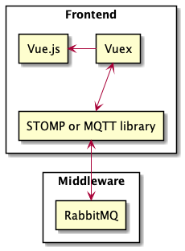
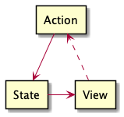

# Frontend


## Frontend-Technologien

+ TypeScript als Programmiersprache
+ Vue.js für View-Komponenten
+ Vuex für single store und unidirectional data flow
+ Library für STOMP oder MQTT (Verbindung zu RabbitMQ)




## Vue.js

+ Frontend Framework für UI-Komponenten
+ Vergleichbar mit React (Virtual DOM, etc.)
+ Komponenten erweitern HTML-Elemente über Direktiven (Natural Templates)

``` html
<template>
    <div id="component-id">
        <button v-bind:initial-count="0">Click to count up</button>
    </div>
</template>
```


## Vuex

+ Ein einziger Datastore als single source of truth
+ Vergleichbar mit Redux
+ Daten fliessen immer in eine Richtung
+ Actions  (User-Interaktion, Messages, etc.) verändern den State, was zu einem update des GUI führt




