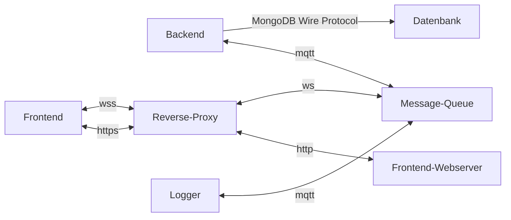

# Architektur

Dieses Kapitel liefert einen Überblick zur Architektur der Applikation.

## Big Picture

Folgende Grafik visualisiert das logische Zusammenspiel der Systemkomponenten und der verwendeten Technologien:

Der oben dargestellte Stack lässt sich mittels
eines [docker-compose](https://github.com/FHNW-WODSS-FS22/team-document-ofabel/blob/master/projects/docker-compose.yml)
Files weitgehend automatisiert bereitstellen.

## Technologie Stack

Dieses Kapitel gibt eine kurze Übersicht über die verwendeten Technologien und Abhängigkeiten.

### Backend

Im [package.json](../../../projects/backend/package.json) sind folgende externe Abhängigkeiten definiert:

* [dotenv](https://www.npmjs.com/package/dotenv) für das Laden der Umgebungsvariablen aus der .env Datei.
* [mongodb](https://www.npmjs.com/package/mongodb) für die Mongo Datenbank Anbindung.
* [ts-node](https://typestrong.org/ts-node/) als Laufzeitumgebung für das Backend.
* [typescript](https://www.typescriptlang.org/) für den Typescript support.

Für die Entwicklung kommen folgende Abhängigkeiten hinzu:

* [eslint](https://eslint.org/) als Linter zur Gewährleistung der Code Qualität.
* [jest](https://jestjs.io/) als Test Framework.
* [ts-jest](https://www.npmjs.com/package/ts-jest) für den Typescript Support der Jest Bibliothek.
* Einige `@types/*` Pakete für die Typisierung.

Der [Docker Container](../../../projects/backend/Dockerfile) verwendet das [node](https://hub.docker.com/_/node) Image
in der LTS Version.

### Frontend

Im [package.json](../../../projects/frontend/package.json) sind folgende externe Abhängigkeiten definiert:

* [@popperjs/core](https://www.npmjs.com/package/@popperjs/core) wird von Bootstrap benötigt.
* [@tiptap/extension-collaboration](https://www.npmjs.com/package/@tiptap/extension-collaboration) für den Collaboration
  Support des TipTap Editors.
* [@tiptap/starter-kit](https://www.npmjs.com/package/@tiptap/starter-kit) eine Sammlung nützlicher Plugins für den
  TipTap Editor.
* [@tiptap/vue-3](https://tiptap.dev/) die Vue Komponente für den TipTap Editor.
* [bootstrap](https://getbootstrap.com) das CSS Framework zur Erstellung eines ansehnlichen UI.
* [bootstrap-icons](https://icons.getbootstrap.com/) Icons für das UI.
* [buffer](https://www.npmjs.com/package/buffer) ein Buffer Polyfill für den Browser, wird für das Bundeln von MQTT.js
  benötigt.
* [core-js](https://www.npmjs.com/package/core-js) bietet Polyfills für diverse JavaScript Funktionalitäten, wird für
  das Bundeln benötigt.
* [process](https://www.npmjs.com/package/process) wird für das Bundeln von MQTT.js benötigt.
* [url](https://www.npmjs.com/package/url) wird für das Bundeln von MQTT.js benötigt.
* [vue](https://vuejs.org/) das Vue Framework für die Erstellung des Frontends.

Für die Entwicklung kommen folgende Abhängigkeiten hinzu:

* [eslint](https://eslint.org/) als Linter zur Gewährleistung der Code Qualität.
* [jest](https://jestjs.io/) als Test Framework.
* [ts-jest](https://www.npmjs.com/package/ts-jest) für den Typescript Support der Jest Bibliothek.
* Einige `@types/*` Pakete für die Typisierung.
* Diverse `@vue/*` Pakete für die Entwicklung der Vue Komponenten.
* [node-sass](https://www.npmjs.com/package/node-sass) für den Sass Support.

Der [Docker Container](../../../projects/frontend/Dockerfile) verwendet das [node](https://hub.docker.com/_/node) Image
für die Build Stage und schliesslich das [nginx](https://hub.docker.com/_/nginx) Image für die Production Stage.

### Logger

Im [package.json](../../../projects/backend/package.json) sind folgende externe Abhängigkeiten definiert:

* [dotenv](https://www.npmjs.com/package/dotenv) für das Laden der Umgebungsvariablen aus der .env Datei.
* [ts-node](https://typestrong.org/ts-node/) als Laufzeitumgebung für das Backend.
* [typescript](https://www.typescriptlang.org/) für den Typescript support.

Der [Docker Container](../../../projects/logger/Dockerfile) verwendet das [node](https://hub.docker.com/_/node) Image in
der LTS Version.

### Mongo Datenbank

Für den [Docker Container](../../../projects/mongodb/Dockerfile) wird das [mongo](https://hub.docker.com/_/mongo) Image
in der Version 5 verwendet.

### Mosquitto

Für den [Docker Container](../../../projects/mosquitto/Dockerfile) wird das
[eclipse-mosquitto](https://hub.docker.com/_/eclipse-mosquitto) Image in der Version 2 verwendet.

### Shared

Im [package.json](../../../projects/backend/package.json) sind folgende externe Abhängigkeiten definiert:

* [@syncedstore/core](https://syncedstore.org/docs/) für die vereinfachte Verwendung von Yjs.
* [mqtt](https://www.npmjs.com/package/mqtt) für die Kommunikation mit dem MQTT Message Broker.
* [pako](http://nodeca.github.io/pako/) für die Komprimierung der MQTT Nachrichten.
* [rotating-file-stream](https://www.npmjs.com/package/rotating-file-stream) für die Rotation der Logfiles.
* [slugid](https://www.npmjs.com/package/slugid) für die Komprimierung von UUIDs.
* [uid](https://www.npmjs.com/package/uid) für die Generierung kompakter Identifier.
* [uuid](https://www.npmjs.com/package/uuid) für die Generierung von UUIDs.
* [yjs](https://docs.yjs.dev/) stellt die [Konfliktresistenten Datentypen](https://crdt.tech/) zur Verfügung.

Für die Entwicklung kommen folgende Abhängigkeiten hinzu:

* [eslint](https://eslint.org/) als Linter zur Gewährleistung der Code Qualität.
* [jest](https://jestjs.io/) als Test Framework.
* [ts-jest](https://www.npmjs.com/package/ts-jest) für den Typescript Support der Jest Bibliothek.
* Einige `@types/*` Pakete für die Typisierung.
* [dotenv](https://www.npmjs.com/package/dotenv) für das Laden der Umgebungsvariablen aus der .env Datei.

## Server Setup

Folgende Grafik visualisiert das physische Setup der Systemkomponenten auf dem Projekt Server:

Links:

- [Frontend](https://wodss.sufa.li)
- [Portainer](https://wodss.sufa.li/portainer)
- [Cedalo](http://wodss.sufa.li:8088)

### wodss.sufa.li

Eine virtueller Ubuntu Server, welcher von Switch Engine gehostet wird. Nebst dem standard Ubuntu setup wurden folgende
Applikationen installiert:

- Docker
  - Stellt eine Plattform zur Containerisierung der Systemkomponenten zur Verfügung
- Nginx
  - Fungiert als Reverse Proxy und zur HTTPS Terminierung
- CertBot
  - Verwaltet das SSL Zertifikat des Nginx Proxy

### Docker

Folgende Applikationen werden als Docker Container betrieben:

- Git Hub Actions Runner
  - Ausführung der GitHub Actions (CI / CD Pipeline)
- Portainer
  - Docker Management Web Interface
- Cedalo Managment Center
  - Mosquitto Managment Web Interface
- wodss Stack
  - Während des wodss Projekts erstellte Applikationen

## Konfigurationsmanagement

Alle Applikationen des wodss Stack werden mittels Umgebungsvariablen konfiguriert. Eine detaillierte Beschreibung der
Variablen findet sich [hier](./05-components.md#umgebungsvariablen)
Die folgenden sicherheitsrelevanten Variablen sind als GitHub Secrets hinterlegt und werden erst während des Deployment
Prozesses gesetzt:

- PROD_MONGODB_USER_PASSWORD
- PROD_MOSQUITTO_PASSWORD_ADMIN
- PROD_MQTT_PASSWORD_BACKEND
- PROD_MQTT_PASSWORD_FRONTEND
- PROD_MQTT_PASSWORD_MONITOR
- PROD_MQTT_PW
- TEST_MONGODB_USER_PASSWORD
- TEST_MOSQUITTO_PASSWORD_ADMIN
- TEST_MQTT_PASSWORD_BACKEND
- TEST_MQTT_PASSWORD_FRONTEND
- TEST_MQTT_PASSWORD_MONITOR
- TEST_MQTT_PW

## Zusammenspiel der Komponenten

Folgendes Diagramm zeigt die Zusammenhänge zwischen den verschiedenen Komponenten:

Als zentrales Element dient die Message Queue, welche alle Komponenten miteinander verbindet. Die Kommunikation erfolgt,
ausser zwischen Backend und Datenbank, über die Message Queue. Es findet ansonsten keine direkte Kommunikation zwischen
den Komponenten statt.

Ein interessantes Konzept versteckt sich hinter der Logger Komponente. In der Shared Library wurde eine eigene Logging
Klasse geschrieben, welche von allen Komponenten verwendet wird. Diese Klasse schickt alle Log Meldungen auf das `/log`
Topic der Message Queue. Die Logging Komponentne, welche sich auf diesem Topic subscribed hat, bekommt so alle
Logmeldungen mit und kümmert sich umd das Schreiben von Log Files. So lassen sich mittels entsprechenden MQTT Adaptern
beliebige weitere Monitoring / Logging Systeme anbinden. (Splunk / Prometheus / etc.)
Die Logging Komponentne, welche sich auf diesem Topic subscribed hat, bekommt so alle Logmeldungen mit und kümmert sich
um das Schreiben von Log Files.

## Security

Die Applikation kann durch die Message Queue vor unrechtmässigem Zugriff geschützt werden. Standardmässig ist ein
Benutzer mit einem Passwort konfiguriert. Mosquitto würde die Möglichkeit einer Benutzerverwaltung bieten, um eine
personalisierte Benutzerverwaltung umzusetzen. Aktuell wird das Passwort via GitHub Secret in der Build Pipeline dem
Frontend hinzugefügt. Mosquitto würde die Möglichkeit
einer [Benutzerverwaltung](https://mosquitto.org/documentation/dynamic-security/) bieten, um eine personalisierte
Benutzerverwaltung umzusetzen.

### State Security

Es wurde keine Validierung der State Integrität umgesetzt. Aktuell besteht das Problem, dass autentifizierte Benutzer
den synchronisierten State manipulieren können. Eine Integritätsprüfung des synchronisierten States könnte entweder auf
dem Backend oder dezentral auf jedem Client durchgeführt werden. Aktuell besteht das Problem, dass authentifizierte
Benutzer den synchronisierten State manipulieren können.

### Credentials Management

Alle produktiven User Credentials zur Authemtifizierung der verschiedenen Komponenten untereinander wurden als GitHub
Secrets hinterlegt und werden beim Deployment des Application Stack gesetzt.

### Kommunikationsverschlüsselung

Der gesamte Netzwerkverkehr der Applikation ist mittels SSL verschlüsselt. Dies gilt ebenfalls für die Websocket
Verbindungen.

Zur SSL Terminierung des eingehenden Netzwerkverkehrs wurde ein nginx Reverse Proxy eingerichtet. Die interne
Kommunikation zwischen den Komponenten findet unverschlüsselt statt. Zur SSL Terminierung des eingehenden
Netzwerkverkehrs wurde ein Nginx Reverse Proxy eingerichtet.

Ein Diagramm zur Übersicht der Kommunikation befindet sich [hier](#zusammenspiel-komponenten)
