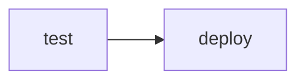
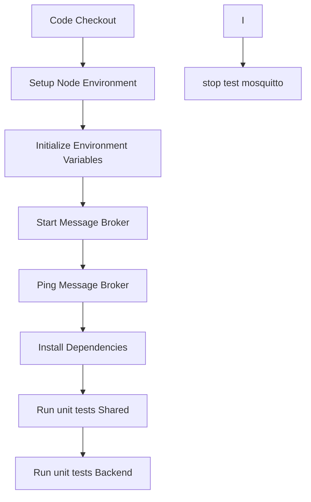
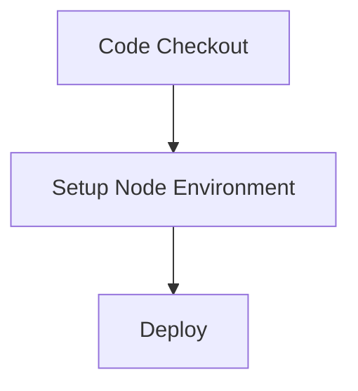

# Entwicklung

Die Arbeiten am Projekt waren im Team folgendermassen aufgeteilt:

* **Backend** ursprünglich David Roth, aufgrund des Wegfalls aber Melvin Johner
* **Frontend** wurde doppelt implementiert: Philip Colombo und Oliver Fabel, Tests von Melvin Johner
* **Logger** wurde von Melvin Johner implementiert
* **Mongo Datenbank** wurde von Melvin Johner aufgesetzt
* **Mosquitto** wurde von Oliver Fabel aufgesetzt
* **Shared** wurde von Oliver Fabel umgesetzt
* **Server (Portainer, Webserver, Cedalo, Docker, GitHub Runner)** wurde von Melvin Johner aufgesetzt
* **Pipeline** wurde von Melvin Johner eingerichtet

## CI/CD
Eine CI/CD Pipeline mittels GitHub Actions wurde konfiguriert.
Zur Ausführung der Pipeline wurde ein eigener GitHub Actions Runner installiert und mit dem GitHub Repository verknüpft.

Die [Pipeline](https://github.com/FHNW-WODSS-FS22/team-document-ofabel/blob/master/.github/workflows/deploy.yml) beinhaltet zwei Stages:

- test
- deploy

In jeder Stage sind die sicherheitsrelevanten Environment Variablen in GitHub Secrets ausgelagert.

### Test
Die Test Stage wird auf jedem Branch bei jedem Push ausgeführt.

### Deploy
Die Deploy Stage wird nach der Test Stage ausgeführt, wenn der Master Branch aktualisiert wurde. 

