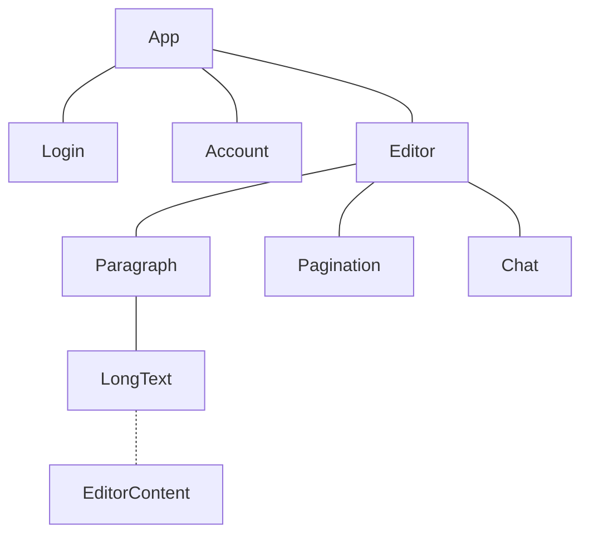
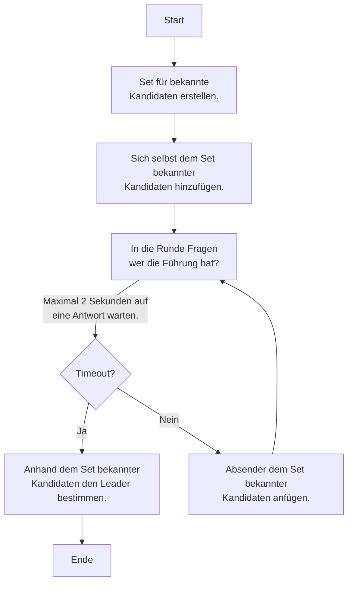
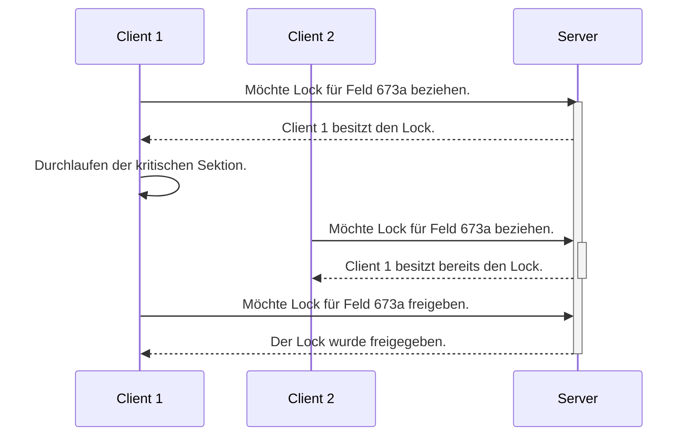

# Komponenten

Dieses Kapitel beschreibt Aufbau, Aufgabe und Funktionsweise der einzelnen Komponenten der Applikation. Die Komponenten
sind allesamt im Ordner [/projects](../../../projects) abgelegt. Ganz allgemein lässt sich die Applikation in 7
Komponenten aufteilen.

## [Config](../../../projects/config)

Für alle Komponenten relevant ist die Konfigurationsverwaltung. Diese befindet sich im
Ordner [/projects/config](../../../projects/config). Für jede Umgebung befindet sich hier ein separates
Unterverzeichnis. Darin befindet sich eine `.env` Datei mit Umgebungsvariablen und ein Verzeichnis mit
Loggerkonfigurationen für die einzelnen Komponenten.

### Umgebungsvariablen

Im Folgenden wird kurz auf die Bedeutung der einzelnen Umgebungsvariablen eingegangen. Je nach Umgebung sind nicht alle
Variablen im `.env` definiert, dies betrifft insbesondere sicherheitsrelevante Variablen wie Passwörter. Diese werden
dann per GitHub Secrets waltet.

#### WODSS_YJS_VERSION

Dies ist ein Feature Trigger für die verwendete [Yjs Version](https://github.com/yjs/yjs#using-v2-update-format).
Erlaubte Werte sind entweder `1` oder `2`.

#### WODSS_DOCKER_RESTART

Diese Variable steuert das Neustartverhalten der Dockercontainer. Typische Werte sind `no` oder `always`, grundsätzlich
sind aber alle Werte gemäss
der [Restart Policy](https://docs.docker.com/config/containers/start-containers-automatically/#use-a-restart-policy)
erlaubt.

#### WODSS_SYNC_STORE_MQTT_QOS

Diese Variable bestimmt welche [QoS](https://docs.oasis-open.org/mqtt/mqtt/v5.0/os/mqtt-v5.0-os.html#_Toc3901234) für
Update Nachrichten zwischen den Sync Stores verwendet werden soll. Erlaubte Werte sind `0`, `1` oder `2`. Wobei dringend
abgeraten wird `0` zu verwenden.

#### WODSS_SYNC_STORE_DEBOUNCE

Dieser Wert bestimmt die Anzahl Millisekunden zwischen dem Publizieren einzelner Sync Store Nachrichten. Sinnvolle Werte
finden sich im Bereich zwischen `0` und `125`.

#### WODSS_MQTT_COMPRESSION_THRESHOLD

Dies ist der Schwellwert in Bytes für die Komprimierung von MQTT Nachrichten. Ein Wert unter `0` deaktiviert die
Komprimierung vollständig. Mit `0` wird die Komprimierung immer aktiviert. Da die Komprimierung Rechenleistung und somit
Zeit in Anspruch nimmt, macht es Sinn diese erst ab einem bestimmten Schwellwert zu aktivieren.

#### WODSS_MQTT_COMPRESSION_LEVEL

Dieser Wert bestimmt das Kompressionslevel für die Komprimierung von MQTT Nachrichten. Erlaubte Werte sind von `0` (
keine Komprimierung) über `1` (beste Performance, schwächste Komprimierung) bis `9` (langsamste Performance, grösste
Komprimierung).

#### WODSS_MOSQUITTO_PORT_WS

Dieser Wert bestimmt den TCP Port für den Websocket Listener des Mosquitto Docker Containers.

#### WODSS_MOSQUITTO_PORT_MQTT

Dieser Wert bestimmt den TCP Port für den MQTT Listener des Mosquitto Docker Containers.

#### WODSS_MOSQUITTO_HOST

Dieser Wert setzt den Hostname für den Mosquitto Docker Container.

#### WODSS_MOSQUITTO_USERNAME_BACKEND

Der Benutzername für den Backend Mosquitto Benutzer.

#### WODSS_MOSQUITTO_PASSWORD_BACKEND

Das Passwort für den Backend Mosquitto Benutzer.

#### WODSS_MOSQUITTO_USERNAME_FRONTEND

Der Benutzername für den Frontend Mosquitto Benutzer.

#### WODSS_MOSQUITTO_PASSWORD_FRONTEND

Das Passwort für den Frontend Mosquitto Benutzer.

#### WODSS_MOSQUITTO_USERNAME_MONITOR

Der Benutzername für den Monitor Mosquitto Benutzer.

#### WODSS_MOSQUITTO_PASSWORD_MONITOR

Das Passwort für den Monitor Mosquitto Benutzer.

#### WODSS_MOSQUITTO_USERNAME_ADMIN

Der Benutzername für den Mosquitto Admin Benutzer.

#### WODSS_MOSQUITTO_PASSWORD_ADMIN

Das Passwort für den Mosquitto Admin Benutzer.

#### WODSS_MONGODB_USERNAME

Der Benutzername für die Mongo Datenbank.

#### WODSS_MONGODB_PASSWORD

Das Passwort für die Mongo Datenbank.

#### WODSS_MONGODB_DATABASE

Der Datenbankname für die Mongo Datenbank.

#### WODSS_MONGODB_HOST

Der Hostname für den Mongo Datenbank Docker Container.

#### WODSS_MONGODB_PORT

Der TCP Port für den Mongo Datenbank Docker Container.

#### WODSS_MONGODB_DOCKER_VOLUME

Unter diesem Pfad wird das Docker Volumen für die Mongo Datenbank eingebunden.

#### WODSS_LOGGER_MQTT_HOST

Eine IP-Adresse oder ein Hostname eines MQTT Brokers, auf den sich der Logger verbinden soll.

#### WODSS_LOGGER_MQTT_PORT

Der TCP Port des MQTT Brokers, auf den sich der Logger verbinden soll.

#### WODSS_LOGGER_MQTT_PROTOCOL

Das zu verwendende Protokoll für die Verbindung zwischen Logger und MQTT Broker. Gängige Werte sind `mqtt` oder `ws`.

#### WODSS_LOGGER_MQTT_PATH

Der Pfad, unter dem der MQTT Broker auf dem Host erreichbar ist. Dieser Wert ist primär für das Websockets Protokoll
relevant.

#### WODSS_LOGGER_MQTT_TOPIC

Auf diesem MQTT Topic empfängt der Logger die Nachrichten. Analog dazu publizieren Frontend und Backend ihre Logs auf
diesem Topic.

#### WODSS_LOGGER_PATH

In diesem Verzeichnis persistiert der Logger die Logdatei.

#### WODSS_LOGGER_DOCKER_VOLUME

Unter diesem Pfad wird das Docker Volumen für die Logdateien eingebunden.

#### WODSS_BACKEND_MQTT_HOST

Eine IP-Adresse oder ein Hostname eines MQTT Brokers, auf den sich das Backend verbinden soll.

#### WODSS_BACKEND_MQTT_PORT

Der TCP Port des MQTT Brokers, auf den sich das Backend verbinden soll.

#### WODSS_BACKEND_MQTT_PROTOCOL

Das zu verwendende Protokoll für die Verbindung zwischen Backend und MQTT Broker. Gängige Werte sind `mqtt` oder `ws`.

#### WODSS_BACKEND_MQTT_PATH

Der Pfad, unter dem der MQTT Broker auf dem Host erreichbar ist. Dieser Wert ist primär für das Websockets Protokoll
relevant.

#### WODSS_BACKEND_MQTT_MIN_LATENCY

Der minimale Wert in Millisekunden für die Latenz Simulation.

#### WODSS_BACKEND_MQTT_MAX_LATENCY

Der maximale Wert in Millisekunden für die Latenz Simulation.

#### WODSS_BACKEND_MONGODB_HOST

Eine IP-Adresse oder ein Hostname für die Mongo Datenbank Anbindung.

#### WODSS_FRONTEND_MQTT_HOST

Eine IP-Adresse oder ein Hostname eines MQTT Brokers, auf den sich das Frontend verbinden soll.

#### WODSS_FRONTEND_MQTT_PORT

Der TCP Port des MQTT Brokers, auf den sich das Frontend verbinden soll.

#### WODSS_FRONTEND_MQTT_PROTOCOL

Das zu verwendende Protokoll für die Verbindung zwischen Backend und MQTT Broker. Gängige Werte sind `ws` oder `wss`. Da
das Frontend im Browser läuft muss zwingend eine Websocket basierte Verbindung verwendet werden.

#### WODSS_FRONTEND_MQTT_PATH

Der Pfad, unter dem der MQTT Broker auf dem Host erreichbar ist.

#### WODSS_FRONTEND_MQTT_MIN_LATENCY

Der minimale Wert in Millisekunden für die Latenz Simulation.

#### WODSS_FRONTEND_MQTT_MAX_LATENCY

Der maximale Wert in Millisekunden für die Latenz Simulation.

#### WODSS_FRONTEND_HTTP_PORT

Unter diesem TCP Port wird der Webserver Docker Container des Frontends exponiert.

### Logger Konfiguration

Der Logger wird pro relevante Komponente über eine JSON Datei konfiguriert. Mehr Informationen zur Logger Konfiguration
findet sich im entsprechenden Kapitel über den Logger.

### Verteilen der Konfiguration

Die Konfiguration wird über ein [Bash Skript](../../../projects/setup.sh) zusammengebaut und verteilt. Der folgende
Aufruf initialisiert die Umgebung mit der `local` Konfiguration:

```shell
./setup.sh local
```

Dabei werden `.env` und die Loggerkonfigurationen aus dem [/projects/config/local](../../../projects/config/local)
Verzeichnis gelesen und verteilt. Jede Komponente hat danach ihr eigenes `.env` und `log.json`.

## [Backend](../../../projects/backend)

Das Backend ist eine Node Applikation implementiert in Typescript. Zu seinen Aufgaben gehören:

* Instanziierung der synchronisierten Stores.
* Persistierung der Zustände in einer Mongo Datenbank.

Der meiste, vom Backend verwendete, Code befindet sich im Shared Modul. Das Backend verhält sich grundsätzlich nicht
anders als ein frontend Client. Mit dem Unterschied, dass das Backend einen Mongo Datenbank Adapter instanziiert und
damit periodisch die Zustände persistiert und bei Bedarf auch wieder herstellt.

Für den Betrieb in der produktiven Umgebung läuft das Backend in einem Docker Container. Auf ein vorgängiges Transpiling
des Typescript Codes nach JavaScript wird verzichtet und stattdessen [ts-node](https://typestrong.org/ts-node/)
verwendet.

Da sich das Backend grundsätzlich wie ein normaler frontend Client verhält lassen sich auch mehrere Instanzen des
Backends parallel starten. Die Instanzen handeln dann untereinander aus wer den Lead übernimmt. Beendet sich der
Leader (gewollt oder durch einen Fehler), wird dies von den übrigen Instanzen bemerkt und ein neuer Leader übernimmt die
Führung. Die Applikation ist somit grundsätzlich Hochverfügbar. Natürlich müsste zusätzlich der MQTT Broker, die Mongo
Datenbank und der Webserver für das Frontend in einem Cluster Betrieben und hinter
einem [HAProxy](https://www.haproxy.org/) betrieben werden.

## [Frontend](../../../projects/frontend)

Es handelt sich um eine Single-Page-Application auf Basis von [Vue 3](https://vuejs.org/)
und [Bootstrap 5](https://getbootstrap.com/) als CSS Framework. Um die Entwickler bei ihrer Arbeit zu unterstützen
wird [Vue CLI](https://cli.vuejs.org/) verwendet. Der meiste, vom Frontend verwendete, Code befindet sich im Shared
Modul. Das Frontend beschränkt sich auf Instanziierung der Stores, UI Logik und Darstellung
mittels [Single File Components](https://vuejs.org/guide/scaling-up/sfc.html#single-file-components). Durch die
Verwendung von _Single File Components_ lässt sich bündeln was zusammen gehört. Anstatt separate Dateien für das Markup,
Logik und die Styles eines Komponenten zu haben ist alles in einer Datei gebündelt. Für die wenigen Styles bezogenen
Anpassungen und Ergänzungen wurde [Sass](https://sass-lang.com) hinzugezogen. Wenn auch nur wenige Anpassungen notwendig
sind lassen sich diese durch die Verwendung von Sass besser mit _Bootstrap_ integrieren, da gleich die vordefinierten
Variablen und Mixins genutzt werden können. Durch die Verwendung von Bootstrap war es möglich ohne grösseren Aufwand das
Frontend responsive zu gestalten.

### Verwendung der Komponenten

Die Verwendung und Verschachtelung der Komponenten lässt sich mit folgendem Diagramm beschreiben:



Im Folgenden werden die einzelnen UI Komponenten kurz beschrieben und etwaige Eigenheiten erläutert.

#### [App](../../../projects/frontend/src/components/App.vue)

Dies ist die zentrale und oberste Komponente. Auf die Verwendung eines Routers wurde bewusst verzichtet. Stattdessen
wird die aktuell angezeigte Seite
im [Session Storage](https://developer.mozilla.org/en-US/docs/Web/API/Window/sessionStorage) des Browsers gehalten.
Bestandteil dieser Komponente ist neben der Navigation die Ladeanzeige. Diese legt sich als Overlay über das gesamte UI
und ändert den Mauszeiger zu einer Sanduhr (`cursor: wait`). Dauert eine Operation etwas länger, so wird nach einer
Sekunde noch ein Spinner dargestellt und das Overlay färbt sich weiss mit 25% transparenz.

#### [Login](../../../projects/frontend/src/components/Login.vue)

Diese Komponente dient der Authentifizierung der Benutzer. Auf ein echtes Login mit Benutzernamen und Passwort wurde
einfachheitshalber verzichtet. Stattdessen kann eine beliebige E-Mail-Adresse angegeben werden. Ausgehend davon wird
dann die einmalige und eindeutige Benutzer ID errechnet. Dies passiert durch die Verwendung einer Version 5 UUID. Die
Nutzersession wird zusammen mit den Informationen über den Benutzer im `user` Store persistiert.

#### [Account](../../../projects/frontend/src/components/Account.vue)

Hier können der Benutzername und die dazugehörige Farbe geändert werden. Diese werden im `user` Store persistiert.

#### [Editor](../../../projects/frontend/src/components/Editor.vue)

Der Editor kümmert sich um die Darstellung des Dokuments und des dazugehörigen Chats. Die Daten stammen dabei aus dem
dazugehörigen `editor` und `chat` Store. Zudem kümmert sich die Komponente um die Aktualisierung des Fokus und das
Nachfahren des Scrollbalkens. Dies passiert automatisch, wenn sich ein Paragraf im Fokus befindet und von aussen eine
Änderung am Dokument vorgenommen wird (z.B. Hinzufügen oder Entfernen eines Paragrafen oder die Änderung von Text).
Nebenbei ist der Fuzzy Frontend Test in dieser Komponente implementiert. Aus Gründen der Performance wurde eine
Pagination eingeführt und die Anzahl dargestellter Paragrafen pro Seite auf 10 beschränkt. Die Erfahrung hat gezeigt,
dass das UI wesentlich flüssiger läuft, wenn weniger Paragrafen gerendert werden müssen.

#### [Paragraph](../../../projects/frontend/src/components/Paragraph.vue)

Diese Komponente stellt einen einzelnen Paragrafen dar. Dabei wird auch eine Toolbar angeboten, über welche verschiedene
Aktionen wie Bearbeiten, Löschen, Einfügen und Verschieben eines Paragrafen ermöglicht.

#### [Pagination](../../../projects/frontend/src/components/Pagination.vue)

Dies ist eine simple Komponente zur Darstellung der, für den Editor notwendigen, Pagination.

#### [Chat](../../../projects/frontend/src/components/Chat.vue)

Die Chat Komponente hat zwei primäre Aufgaben: Zum einen die Auflistung der Nutzer, welche das Dokument gerade geöffnet
haben. Und zum anderen die Darstellung des Chatverlaufs. Der Chat ist pro Dokument unterschiedlich. Das heisst, jedes
Dokument hat seinen eigenen Chatverlauf.

#### [LongText](../../../projects/frontend/src/components/LongText.vue)

Diese Komponente stellt den Text eines Paragrafen dar. Dazu wird der [TipTap Editor](https://tiptap.dev/) als Vue
Komponente verwendet. Die Verwendung des TipTap Editor hat gegenüber eines normalen Textfeldes folgende Vorteile:

* Neben reinem Text lassen sich auch Formatierungen wie Kursiv, Fett, Durchgestrichen, Listen, Titel usw. darstellen.
* TipTap unterstützt die Verwendung von [Yjs](https://docs.yjs.dev/). Dadurch wird bei einer Textänderung nur ein Delta
  übertragen und nicht der ganze Text, wie das bei einem String der Fall wäre.

Um das Frontend in der produktiven Umgebung auszuliefern wird der Code mit Webpack im `production` Mode gebündelt und in
einem Docker Container mit einem [nginx](https://nginx.org/) Webserver als statische Ressourcen gehostet.

### Monitor

Der Monitor ist analog dem [Logger](#logger) eine Darstellung der Log Nachrichten in Echtzeit. Er verwendet dazu einen
[Log Client mit DOM Appender](#log). Der Monitor wurde implementiert um einfacher Debuggen und Testen zu können. Dazu
hat der DOM Appender eine kleine Filter- und Suchfunktion auf Basis von CSS Selektoren eingebaut. In der lokalen
Entwicklungsumgebung kann der Monitor
unter [localhost:8080/monitor.html](http://localhost:8080/monitor.html#eyJ1cmwiOiJ3czovL2xvY2FsaG9zdDo5MDAxL3dzIiwidXNlcm5hbWUiOiJtb25pdG9yIiwicGFzc3dvcmQiOiJHbzdrSm9LMVM3N2VDRXh3bWQzdSJ9)
erreicht werden.

### Fuzzy Test

Der Fuzzy Test ist ein simpler UI Test, welcher zufällige Aktionen auf einer Editor Instanz ausführt. Um den Fuzzy Test
im Frontend zu aktivieren, muss der Query Parameter `?fuzzy` mitgegeben werden. In einer lokalen Entwicklungsumgebung
kann der Fuzzy Test unter [localhost:8080?fuzzy](http://localhost:8080/?fuzzy) erreicht werden. Mehr Informationen zum
Fuzzy Test finden sich im Kapitel [Testing](./04-testing.md#fuzzy-test).

## [Logger](../../../projects/logger)

Der Logger ist grundsätzlich nur ein Proof-of-Concept. Das Konzept hinter dem Logging sieht vor (wie an anderer Stelle
bereits beschrieben), dass alle Komponenten auf ein zentrales MQTT Topic Logs publizieren können. Diese werden dann von
einer zentralen Instanz empfangen und ausgewertet. In diesem Fall ist der Logger die zentrale Instanz, dieser gibt die
Logs auf der Standardausgabe aus und persistiert sie zusätzlich in einem rotierenden Logfile.

Analog zum [Backend](#backend) läuft auch der Logger im produktiven Betrieb in einem Docker Container.

## [Shared](../../../projects/shared)

Dies ist mit Abstand die umfangreichste Komponente. Hier ist der gemeinsame Code für [Backend](#backend)
, [Frontend](#frontend) und [Logger](#logger) enthalten. Das Modul wird jeweils als lokale Abhängigkeit im
entsprechenden `package.json` eingetragen. Auch hier handelt es sich um reinen Typescript Code. Dieser ist
folgendermassen organisiert:

```text
src/
├── chat
├── core
│   ├── db
│   ├── hub
│   ├── log
│   ├── mom
│   ├── msg
│   ├── store
│   ├── uid
│   └── util
├── editor
├── index
├── test
└── user
```

Von zentraler Bedeutung ist das `core` [Modul](../../../projects/shared/src/core). Dieses beinhaltet die Implementation
der Kernbestandteile der Applikation. Diese sind wiederum in einzelne Module aufgeteilt:

### [db](../../../projects/shared/src/core/db)

Hier befinden sich das [Interface für den Datenbankadapter](../../../projects/shared/src/core/db/adapter.ts) und die
dazugehörigen Implementationen von [Memory](../../../projects/shared/src/core/db/memory.ts)-
und [Dummyadapter](../../../projects/shared/src/core/db/dummy.ts).

### [hub](../../../projects/shared/src/core/hub)

Das Hubmodul stellt den [Sync Store Hub](../../../projects/shared/src/core/hub/sync-store.ts) zur Verfügung. Die Aufgabe
des Hub ist es, die Sync Store Instanzen zu erstellen und zu verwalten. Um die Store Instanzen zu erstellen und deren
Zustände zu persistieren, verwendet er einen [Datenbankadapter](#db), welcher bei der Instanziierung des Hub übergeben
wird. Ausserdem kümmert sich der Hub um das Aushandeln des Leaders bei mehreren server Instanzen (normalerweise sind
dies [Backends](#backend)). Zum Ermitteln, wer die Führung bei mehreren Servern übernimmt, wird folgender _Leadership
Election_ Algorithmus angewendet:



Andere Server (Kandidaten) hören auf dem Broadcast Topic auf entsprechende Anfragen und antworten mit `i am` sofern es
sich um den gegenwärtigen Leader handelt. Ist ein Leader vorhanden terminiert die Suche sofort. Solang noch kein Leader
gewählt wurde, fragen die Kandidaten so lange in die Runde, bis keine neuen Kandidaten mehr entdeckt werden (in diesem
Fall ist der Timeout erreicht). Dann wird anhand der eindeutigen Absender ID entschieden, wer die Führung übernimmt.
Dazu werden die gesammelten IDs ihrem Wert nach geordnet (es handelt sich um Version 4 UUID). Es gewinnt die niedrigste
ID. Die so entstandene Rangliste ist gleichzeitig auch Grundlage für die _Thronfolge_. Beendet sich der Prozess des
Leaders übernimmt automatisch der nächste in der Reihe. Neu dazukommende Instanzen werden automatisch ans Ende der Liste
angefügt. Dieser Algorithmus entspricht grundsätzlich dem Prinzip
der [Exhaustive Search](https://en.wikipedia.org/wiki/Brute-force_search).

Damit ein Hub Sync Store Instanzen konstruieren kann, muss er die entsprechenden `StateTreeFactory` Klassen kennen.
Diese werden beim Initialisieren des Hubs übergeben. Dabei bietet der Hub die Methoden `open()`, `close()`
und `delete()` an. Diese dienen zum Öffnen, Schliessen und Löschen einer Store Instanz.

Der Hub wird benötigt, da zu jedem Store im Client Modus ein Store im Server Modus existieren muss. Dieser kümmert sich
dann um die Synchronisation der Zustände und verwaltet die Locks in der Mutex Registry. Ausserdem wird der Zustand des
Stores im Server Modus periodisch mit dem Persistence Adapter gesichert.

### [log](../../../projects/shared/src/core/log)

Das Logmodul kümmert sich um Bereitstellung von Logger Instanzen. Die Logger Instanzen werden pro Kategorie
vom [Manager](../../../projects/shared/src/core/log/manager.ts) als Singleton instanziiert. Eine Logger Instanz kann
einer Kategorie angehören und verfügt über verschiedene Appender. Ein Appender definiert, wo die Logs _angehängt_
werden. Eine Nachricht kann auch an mehrere Appender weitergeleitet werden. Folgende Appender sind implementiert:

* [Konsole](../../../projects/shared/src/core/log/appender/console.ts)
  * Die empfangenen Nachrichten werden auf der Standardausgabe dargestellt.
  * Eignet sich für Konsolen Applikationen, wie z.B. das [Backend](#backend).
* [DOM](../../../projects/shared/src/core/log/appender/dom.ts)
  * Hängt die empfangenen Nachrichten an einem Knoten im DOM an.
  * Eignet sich für die Darstellung in einem Browser, wird z.B. im Monitor verwendet.
* [Datei](../../../projects/shared/src/core/log/appender/file.ts)
  * Schreibt die empfangenen Nachrichten in eine Logdatei.
  * Die Logdatei kann auch rotiert werden.
* [MQTT](../../../projects/shared/src/core/log/appender/mqtt.ts)
  * Publiziert die empfangenen Nachrichten auf einem MQTT Topic.
  * Hilfreich zum Sammeln von Logs aus mehreren Quellen.
* [Standard](../../../projects/shared/src/core/log/appender/standard.ts)
  * Leitet die Nachrichten an das [Konsolenobjekt](https://developer.mozilla.org/en-US/docs/Web/API/console) weiter.

Für die [Logger](#logger) Komponente und den Monitor wurde ein [Client](../../../projects/shared/src/core/log/client.ts)
implementiert, welcher sich mit einem MQTT Broker verbinden kann und Logs vom MQTT Appender empfängt. Die empfangenen
Nachrichten werden wiederum an konfigurierte Appender weitergereicht und so abgearbeitet.

**Das Log Modul ist aus dem Bedürfnis entstanden, eine Möglichkeit zu haben die Events in einem verteilten System an
zentraler Stelle gebündelt und chronologisch auszuwerten. Durch gewisse Einschränkungen von JavaScript ist aber ein
verlässliches Debugging nicht gewährleistet. Dies aufgrund der Tatsache, dass die Codestelle des Logaufrufs verfälscht
wird.**

### [mom](../../../projects/shared/src/core/mom)

Dieses Modul bildet einen zentralen Bestandteil in diesem Projekt. Sämtliche MQTT Nachrichten werden durch
den [Dispatcher](../../../projects/shared/src/core/mom/dispatcher.ts) empfangen und übermittelt. Der Dispatcher ist so
konzipiert, dass er grundsätzlich durch eine Implementation eines anderen Protokolls ersetzt werden könnte. So wäre auch
ein STOMP oder HTTP Dispatcher denkbar. Dazu müsste das `IDispatcher` Interface implementiert werden:

```typescript
type IDispatcher = {
    readonly clientId: string;

    get online(): boolean;

    get offline(): boolean;

    get ready(): boolean;

    get activeClients(): string[];

    whenOnline(): Promise<void>;

    whenOffline(): Promise<void>;

    whenReady(): Promise<void>;

    isActiveClient(client: string): boolean;

    destroy(force?: boolean): Promise<void>;

    on(event: DestroyEvent, callback: OnDestroyCallback): UnregisterListenerCallback;

    on(event: OnlineEvent, callback: OnOnlineCallback): UnregisterListenerCallback;

    on(event: OfflineEvent, callback: OnOfflineCallback): UnregisterListenerCallback;

    on(event: ClientHelloEvent, callback: OnClientHelloCallback): UnregisterListenerCallback;

    on(event: ClientByeEvent, callback: OnClientByeCallback): UnregisterListenerCallback;

    subscribe<T>(opts: IDispatcherSubscribeOptions<T>): Promise<boolean>;

    unsubscribe(topic: string): Promise<boolean>;

    publish<T, R>(opts: IDispatcherPublishOptions<T, R>): Promise<IDispatcherPublishResult<T>>;

    publish<T>(opts: msg.Message<T>): Promise<IDispatcherPublishResult<T>>;
};
```

Eine neue Dispatcher Instanz wird über den entsprechenden [Builder](../../../projects/shared/src/core/mom/builder.ts)
erstellt. Dieser liest die Standardkonfiguration aus den Umgebungsvariablen und bietet mit verschiedenen `with*()`
Methoden die Möglichkeit, den Standard vor der Instanziierung des Dispatchers zu überschreiben.

Die konkrete Implementation des Dispatchers ist ein Wrapper, um
den [JavaScript MQTT Client](https://github.com/mqttjs/MQTT.js). Dabei werden einige Eigenschaften des MQTT Version 5
Protokolls genutzt. Damit jeder einzelne Client der Applikation einen Überblick hat, welche Peers überhaupt aktiv sind,
meldet sich jeder Client mit einer _Hello_ Nachricht beim Verbindungsaufbau. Analog dazu publiziert jeder Client eine _
Bye_ Nachricht als [letzten Willen](https://docs.oasis-open.org/mqtt/mqtt/v5.0/os/mqtt-v5.0-os.html#_Toc479576982).
Die _Bye_ Nachricht wird auch bei einem regulären Verbindungsabbau publiziert. So ist sichergestellt, dass alle Peers
entsprechend benachrichtigt werden. Durch diese Architektur entfällt auch ein periodischer Ping oder Verbindungscheck.
Dazu wird das Broadcast Topic `/wodss/mom/public/dispatcher/control/broadcast` verwendet. Um jeden Client einzeln
anzusprechen, empfängt jeder Client Nachrichten auf einem exklusiven
Topic `/wodss/mom/public/dispatcher/control/{client-id}`. Das Protokoll für die Peer Discovery sieht vor, dass bei einem
Empfangenen `hello` jeder Peer auf dem privaten Kanal mit einem `hello` antwortet.

Bei der Verwendung des Dispatcher gibt es auch die Möglichkeit einen Callback auf das Eintreffen von `hello` oder `bye`
Nachrichten zu registrieren. So können andere Komponenten auch auf entsprechende Events reagieren.

### [msg](../../../projects/shared/src/core/msg)

Dieses Modul kümmert sich um die Strukturierung und das Marshalling der [MOM](#mom) Nachrichten. Ein Nachrichtenobjekt
kann mit dem [Builder](../../../projects/shared/src/core/msg/builder.ts) instanziiert werden. Für das Marshalling und
Unmarshalling sind entsprechende Encoder und Decoder Funktionen vorhanden. Dabei besteht auch die Möglichkeit, den
Payload einer Nachricht mit [Pako](http://nodeca.github.io/pako/) zu komprimieren. Dieses Verhalten ist
über [Feature Trigger](#wodss_mqtt_compression_threshold) konfigurierbar. Die clientseitige Komprimierung wurde
implementiert, da Daten über Websockets nicht zwingend komprimiert übertragen werden. Ausserdem würden die Daten
spätestens auf dem reverse Proxy dekomprimiert und zum MQTT Broker weitergereicht werden. Da der Broker nur die
Nachrichten an die verbundenen Clients weiterreicht, kann durch die Komprimierung des Payloads die Menge an übertragenen
Daten und gleichzeitig die Anzahl an komprimierungs und dekomprimierungs Vorgänge reduziert werden.

### [store](../../../projects/shared/src/core/store)

Dieses Modul enthält den Code für die Store Implementierung. In einem Store kann ein öffentlicher Zustand persistiert
werden. Dieser öffentliche Zustand wird zusammen mit dem internen Zustand in einem Yjs Dokument gehalten und lässt sich
über Update Operationen verändern. Im Falle des [SyncStore](../../../projects/shared/src/core/store/sync.ts) kann der
Zustand auch über einen [Dispatcher](#mom) synchronisiert werden. Dabei werden Yjs Delta Updates über die MOM
übertragen. Es werden zwei Arten von Update Operationen unterstützt: Patch und Mutex. Im Unterschied zu einem normalen
Patch kann die Mutex Operation einen Lock auf ein Feld im Zustand beziehen. Der Store besitzt dann exklusive
Schreibrechte auf dieses Feld. Zusätzlich bestehen einige Hilfsfunktionen für den Umgang mit Locks. So ist es möglich
einen Lock auf ein Feld zu beziehen, ohne direkt dessen Inhalt zu verändern. Dieses Feature wird z.B. für das Bearbeiten
eines [Paragrafen](#paragraph) verwendet. So muss nicht bei jedem Tastendruck ein Lock bezogen und danach wieder
freigegeben werden. Ausserdem ist das Beziehen und Freigeben eines Locks eine relativ teure Operation. Die Locks werden
von einem SyncStore im `server` Modus verwaltet. Dazu dient die `mutexRegistry` auf dem internen Zustand. Die Mutex
Registry ist eine simple Key-Value Map von Feld ID auf Session ID. Die Mutex Registry ist auf dem Yjs Dokument des
Stores abgelegt und wird automatisch mit den anderen Peers synchronisiert. Anders als beim öffentliche Zustand des
Stores müssen die Schreibvorgänge auf die Mutex Registry koordiniert erfolgen. Die einfache Lösung dafür sieht vor, dass
ein Store im `client` Modus eine `MutexRequestMessage` auf der MOM publiziert. Diese wird von einem Store im `server`
Modus (gemäss dem _Leadership Election_ Algorithmus des [Hub](#hub) existiert davon im Netzwerk immer nur genau ein
einzelner) mit einer `MutexResponseMessage` beantwortet. Der server Store setzt dann gemäss der `MutexRequestMessage`
den Zustand in der Mutex Registry. Der client Store erfährt dann über das reguläre Zustandsupdate, ob die Aktion
erfolgreich war.



Damit ein neu instanziierter SyncStore den aktuellen Zustand des Dokuments erhält, muss sich dieser erst
synchronisieren. Dazu publiziert er eine Nachricht auf dem `syncRequestTopic`. Ein SyncStore im Server Modus wird diese
Nachricht empfangen und auf dem `syncResponseTopic` mit dem aktuellen Zustand antworten.

Um den Zustand eines Stores in eine JSON repräsentierbare Form zu bringen, steht
ein [Decoder und Encoder](../../../projects/shared/src/core/store/marshal.ts) zur Verfügung. Somit lässt sich der
Zustand in ein strukturiertes Zwischenformat exportieren, welches losgelöst von der internen Yjs Datenstruktur ist.

Zum Initialisieren einer Store Instanz mit einem initialen Zustand wird die `StateTreeFactory` verwendet. Die Funktion
`createStateFactory()` akzeptiert als einziges Argument ein Lambda des Types `StateTreeShapeProducer`. Der Rückgabewert
der Funktion ist eine Instanz der `StateTreeFactory` Klasse. Jedes Zustandsobjekt hat neben einer eindeutigen ID eine
Typ-ID. Die ID ist pro Objekt einzigartig. Die Typ-ID ändert sich für Objekte desselben Types nicht. Dahinter steckt die
Idee, dass beim Persistieren und Laden der Zustände festgestellt werden kann von welchem Typ ein Objekt ist. Der
Datenbank Adapter unterscheidet ja nicht zwischen den Objektarten. So könnte trotzdem eine Triage gemacht werden und
z.B. pro Objekttyp eine eigene Collection oder Tabelle verwendet werden.

Um die Zugriffe und Mutationen des Zustands eines Stores zu kanalisieren wird pro Store
ein [Store Handler](../../../projects/shared/src/core/store/handler.ts) implementiert.

### [uid](../../../projects/shared/src/core/uid)

Dieses Modul dient dem Generieren, Parsen, Vergleichen und Validieren von eindeutigen IDs. Dabei werden die
Module [uuid](https://www.npmjs.com/package/uuid) und [uid](https://www.npmjs.com/package/uid) verwendet. Um kürzere
UUIDs zu erhalten wird auf das Modul [slugid](https://www.npmjs.com/package/slugid) zurückgegriffen. Da JavaScript
keinen UUID Datentyp kennt, werden die UUIDs als String typisiert. Dadurch benötigen sie minim mehr Bytes beim
Übertragen und Persistieren. Slugid komprimiert die UUID auf 22 Zeichen, wodurch sie auch in der Darstellung weniger
Platz benötigen. Da die verwendeten Abhängigkeiten nur in diesem Modul eingebunden werden und sämtliche Aufrufe darauf
über eigene Funktionen geschehen, würden sich die Abhängigkeiten auch ohne grösseren Aufwand ersetzen lassen.

### [util](../../../projects/shared/src/core/util)

Dieses Modul ist eine Sammlung von nützlichen Typen und Hilfsfunktionen:

* `deepClone()` erstellt eine vollständige Kopie eines JSON serialisierbaren Objekts.
* `Writeable()` ist ein generischer Typ um die `readonly` Attribute auf einem Objekt zu entfernen.
* `LookupTable()` ist ein generischer Typ zum Definieren einer Lookup Table.
* `identity()` ist die Identitätsfunktion.
* `retryUntil()` wiederholt einen Funktionsaufruf so lange, bis ein erwarteter Rückgabewert eintritt.
* `waitUntil()` wiederholt einen Funktionsaufruf so lange, bis entweder die Funktion `true` zurückgibt oder ein Timeout
  erreicht wird.
* `nop()` ist keine Operation.
* `utc()` gibt den UNIX Zeitstempel UTC zurück.
* `i18n()` wird für die Internationalisierung im Frontend verwendet.
* `getRandomName()` dient dem Generieren von zufälligen Namen.
* `ucfirst()` stellt sicher, dass der erste Buchstaben eines Strings ein Grossbuchstaben ist.
* `getRandomColor()` generiert einen zufälligen Farbwert in Hex Kodierung.

### [chat](../../../projects/shared/src/chat)

Dieses Modul enthält die Definition des Zustands und den dazugehörigen Store Handler für den Chat. Für die gesamte
Applikation wird nur ein einzelner Chat Store instanziiert, dieser enthält pro Editor Dokument eine Liste von
Nachrichten.

### [editor](../../../projects/shared/src/editor)

Dieses Modul enthält die Definition des Zustands und den dazugehörigen Store Handler für den Editor. Pro Dokument wird
ein eigener Store instanziiert. Dieser enthält ein Array für die Reihenfolge der Paragrafen und eine Map von Paragraf ID
auf das dazugehörige Paragraf Objekt.

### [index](../../../projects/shared/src/index)

Dieses Modul enthält die Definition des Zustands und den dazugehörigen Store Handler für den Dokument Index. Dazu hält
der Store eine Map von Dokument ID auf Dokument Objekt. Das Dokument Objekt enthält den Titel des Dokuments und ein Set
von Session IDs der Teilnehmer, welche das Dokument gerade geöffnet haben. Um Teilnehmer schnell aus dem Teilnehmer Set
zu entfernen, hält der Store auch eine Map von Teilnehmer Session ID auf die geöffneten Dokumente. So kann schnell in
beide Richtungen ein Lookup durchgeführt werden.

### [user](../../../projects/shared/src/user)

Dieses Modul enthält die Definition des Zustands und den dazugehörigen Store Handler für die Benutzerverwaltung. Zum
einen hält der Store eine Map von Benutzer ID auf Benutzer Objekt und zum anderen eine Map von Session ID auf Benutzer
ID. Einmal erstellte Nutzer werden nicht mehr entfernt. Das dazugehörige Mapping von Session ID auf Benutzer ID wird
jedoch abgeräumt, wenn der Benutzer die Verbindung zur MOM kappt.

## [Mongo Datenbank](../../../projects/mongodb)

Die Mongo Datenbank wird verwendet um die Zustände der Stores zu persistieren. Dabei wird die Datenbank in einem eigenen
Docker Container gestartet. Für die Entwicklung kann dies mit dem [Startskript](../../../projects/mongodb/start.sh)
passieren. Dieses Skript baut - sofern notwendig - das Docker Image und startet den Container. Existiert bereits ein
Container mit demselben Namen, so wird dieser durch das Skript erst gestoppt und entfernt. Im Docker Compose Verbund und
auf der produktiven Umgebung wird der Container direkt über Docker Compose gestartet.

Mittels
des [`mongo-init.sh`](https://github.com/FHNW-WODSS-FS22/team-document-ofabel/blob/master/projects/mongodb/docker/mongo-init.sh)
Script wird eine Tabelle und ein darauf berechtigert Benutzer angelegt.

## [Mosquitto](../../../projects/mosquitto)

Der Mosquitto Message Broker ist der zentrale und einzige Kommunikationskanal zwischen allen Komponenten. Darüber
kommunizieren Backend und Frontend. Ausserdem werden die Logs darüber publiziert. Analog zur Datenbank wird auch die
Mosquitto Instanz in einem Docker Container gestartet. Auch hier gibt es zum Erstellen und Hochfahren der Instanz
ein [Startskript](../../../projects/mongodb/start.sh). Für etwas Separierung und einem Plus an Sicherheit werden mehrere
[Benutzer](../../../projects/mosquitto/docker/acl.conf) erstellt. Da MQTT ein eigenes TCP Protokoll ist, für die
Kommunikation mit dem Frontend aber zwangsläufig ein Browser kompatibles Protokoll verwendet wird, ist der Mosquitto mit
zwei Listener konfiguriert: MQTT für die interne Kommunikation und Websockets für die Kommunikation mit dem Browser.
